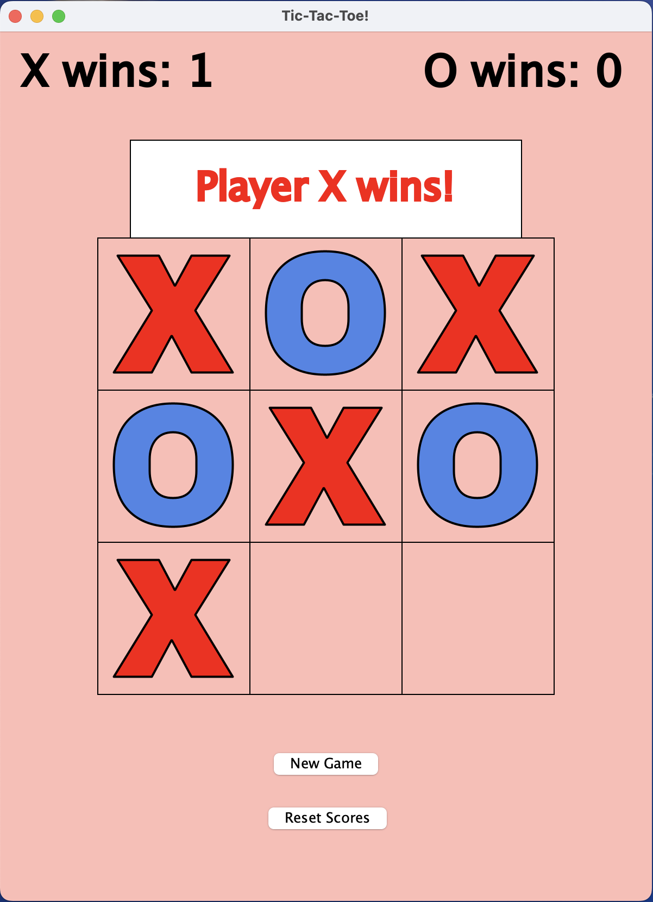

**Tic Tac Toe game**

It is a 3 × 3 grid game  created by Mary Agou ,Anna Wurtz and Bowen. In the game two players, X and O, compete against each other. Each player has up to 8 possible ways to win: 2 diagonal combinations, 3 horizontal combinations, and 3 vertical combinations.

Once a player wins, the game can be restarted, and the scores can also be reset at any time. Players have the option to continue playing new rounds after the previous game ends while keeping track of scores if they choose.

The inspiration for this game came from past experiences of playing Tic-Tac-Toe, which motivated us to create a similar interactive version of the game.

**Software**

The software required to run this project is Visual Studio Code
 (version 25 or later recommended).

To access the code:

-Go to the project repository on [GitHub](https://github.com/mac-comp127-s26/project-anna-bowen-apiu)

-Click the Code button on the repository page.
-Clone the project either using GitHub Desktop or
through the terminal using Git commands:
-Open the cloned project folder in Visual Studio Code.
-Run the project from the terminal or using the appropriate run option in Visual Studio Code.

*Resources referenced*
-An online tic tac game was used as an inspiration
-Google
-Help from the preceptors and instructors(Amin Alhasim)
-Code from already existing class projects

*Limitation of the project*
There no known bugs at the moment sometimes running it for the first the tie logic that sometimes does not run but runs on the second attempt

**This is how the expected output should look like**

[presentation video](https://drive.google.com/file/d/10TmnE64bkjPlJdkt8Lj2kRVkpw_WOfJO/view?usp=sharing)

[slides] https://docs.google.com/presentation/d/1ekkitlPdbx3UrjSgrSuUsqaM6Q_IqbK-m1Rtp70jwxU/edit?usp=sharing

